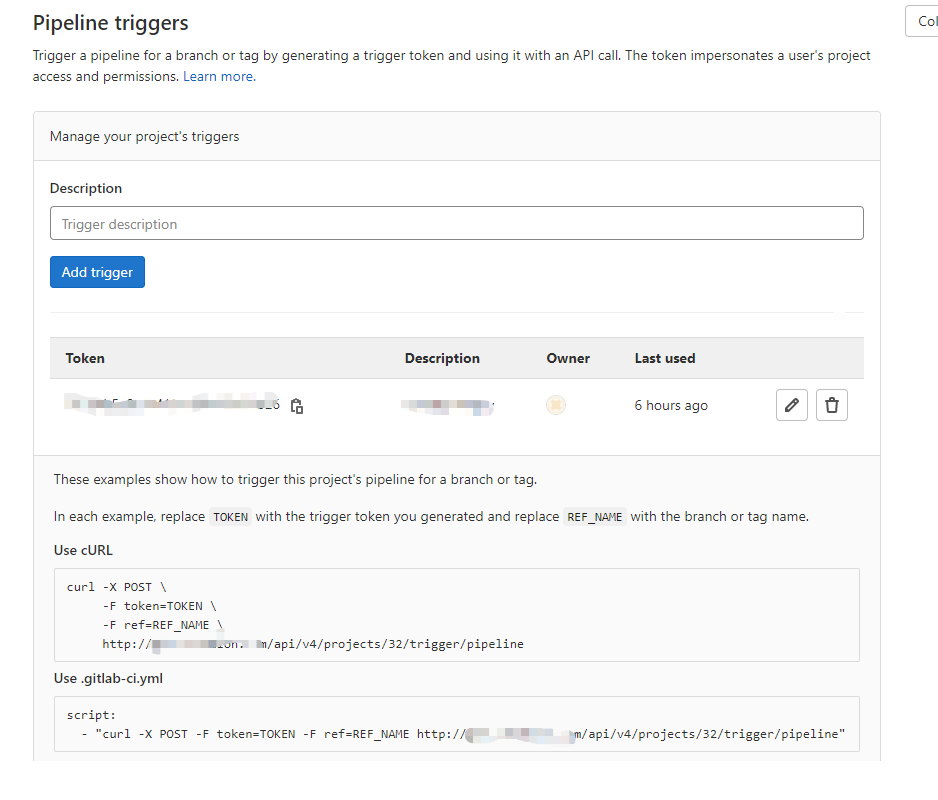

#GITLAB\_MULTI\_PROJECTS\_PIPELINES
There are two projects, one is A and another is B. The requirement is:

1.A triggers a B's job to build when A builds.

2.Wait for B to complete and A downloads the artifacts of B.

3.B continues the left jobs.

There are three solutions to trigger another project to build.

##SOLUTION1:
Use gitlab API with Tigger token([https://docs.gitlab.com/ee/ci/triggers/](https://docs.gitlab.com/ee/ci/triggers/))

###STEPS:
1.Add a new trigger in B and get the ***trigger token***

  Go to your *Settings* > *CI/CD* under *Pipeline triggers* to add a new trigger. The Add trigger button creates a new token which you can then use to trigger a rerun of this particular project’s pipeline.

  Every new trigger you create, gets assigned a different token which you can then use inside your scripts or .gitlab-ci.yml. You also have a nice overview of the time the triggers were last used.

  Also it shows how to trigger this project's pipeline for a branch or tag and you can get the project id.

2.In project B’s *gitlab-ci.yml*, add *triggers* under *only* to allow B run when A uses the trigger API with trigger token. This is necessary, otherwise B can't be triggered by A.(search triggers in [https://docs.gitlab.com/ee/ci/yaml/index.html#only--except](https://docs.gitlab.com/ee/ci/yaml/index.html#only--except))

	job:
  	  # use special keywords
  	  only:
    	- tags
    	- triggers
    	- schedules

3.Add job in A's gitlab-ci.yml to trigger B to build, use script as example in the figure of step1:

	trigger_B:
  		stage: buildB
  	script:
    	- "curl -X POST -F token=TOKEN -F ref=REF_NAME -F variables[key]=value http://${your_git_server}/api/v4/projects/${projectB_id}/trigger/pipeline"

	
The TOKEN is the ***trigger token*** generated from step1.

You can pass any number of arbitrary variables in the trigger API call and they are available in GitLab CI/CD so that they can be used in your .gitlab-ci.yml file. The parameter is of the form:

	variables[key]=value

 	
##SOLUTION2:
	
Use gitlab API with ***CI\_JOB\_TOKEN***([https://docs.gitlab.com/ee/ci/triggers/](https://docs.gitlab.com/ee/ci/triggers/))
This solution doesn't need to generate pipeline trigger token, it uses ***CI\_JOB\_TOKEN***, which is a CI/CD variable. 

- Use of ***CI\_JOB\_TOKEN*** for multi-project pipelines was introduced in GitLab Premium 9.3.

- Use of ***CI\_JOB\_TOKEN*** for multi-project pipelines was made available in all tiers in GitLab 12.4.

###STEPS:

1.In project B’s gitlab-ci.yml, add *pipelines* under only to allow B run when A uses the trigger API with ***CI\_JOB\_TOKEN***. This is necessary, otherwise B can't be triggered by A.(search ***CI\_JOB\_TOKEN*** in [https://docs.gitlab.com/ee/ci/yaml/index.html#only--except](https://docs.gitlab.com/ee/ci/yaml/index.html#only--except))

	job:
  	  # use special keywords
  	  only:
    	- tags
    	- pipelines
    	- schedules

2.Add job in A's gitlab-ci.yml to trigger B to build, the token in the script is ***CI\_JOB\_TOKEN***:

	trigger_B:
  		stage: buildB
  	script:
    	- "curl -X POST -F token=$CI_JOB_TOKEN -F ref=REF_NAME -F variables[key]=value http://${your_git_server}/api/v4/projects/${projectB_id}/trigger/pipeline"

##SOLUTION3:
Use ***trigger*** keywords([https://docs.gitlab.com/ee/ci/pipelines/multi_project_pipelines.html#define-multi-project-pipelines-in-your-gitlab-ciyml-file](https://docs.gitlab.com/ee/ci/pipelines/multi_project_pipelines.html#define-multi-project-pipelines-in-your-gitlab-ciyml-file))

###STEPS:

1.Like step1 in solution2, in project B’s gitlab-ci.yml, add *pipelines* under only to allow B run when A uses ***trigger*** keywords. This is necessary, otherwise B can't be triggered by A.(search ***triggers*** in [https://docs.gitlab.com/ee/ci/yaml/index.html#only--except](https://docs.gitlab.com/ee/ci/yaml/index.html#only--except))

	job:
  	  # use special keywords
  	  only:
    	- tags
    	- pipelines
    	- schedules
    	
2.Add job in A's gitlab-ci.yml to trigger B to build

	trigger_B:
  	variables:
    	ENVIRONMENT: staging
  	stage: buildB
  	trigger: 
		project: pathofprojectA
    	branch: master

There are also three solutions to download B's artifacts after B's build finished.

Note: Because the tags keyword doesn't allow to used in trigger job, if *Can run untagged jobs* option in your gitlab runner is set as No, the the trigger job can't be created. You need to set this option as Yes.

##SOLUTION1:
Using the ***CI\_JOB\_TOKEN*** variable that identifies a specific job to download.([https://docs.gitlab.com/ee/ci/triggers/#when-a-pipeline-depends-on-the-artifacts-of-another-pipeline](https://docs.gitlab.com/ee/ci/triggers/#when-a-pipeline-depends-on-the-artifacts-of-another-pipeline))
 
The use of ***CI\_JOB\_TOKEN*** in the artifacts download API was introduced in GitLab Premium 9.5.

I use GitLab free, so I don't try this.

##SOLUTION2
If A use ***trigger*** keywords to trigger B, then it can list pipeline bridges([https://docs.gitlab.com/ee/api/jobs.html#list-pipeline-bridges](https://docs.gitlab.com/ee/api/jobs.html#list-pipeline-bridges)).

###STEPS:
1.Create a personal access token, please refer to ([https://docs.gitlab.com/ee/user/profile/personal_access_tokens.html#create-a-personal-access-token](https://docs.gitlab.com/ee/user/profile/personal_access_tokens.html#create-a-personal-access-token))

2.List A's pipeline bridges

	curl --header "PRIVATE-TOKEN: <your_access_token>" "https://${your_git_server}/api/v4/projects/${projectA_id}/pipelines/${projectA_pipeline_id}/bridges"

From the response JSON, you can get the B's pipeline id.

3.List B's pipeline jobs according to pipeline id and get the first job's id:

	
	JOB_ID=$(curl --header "PRIVATE-TOKEN: <your_access_token>" "https://${your_git_server}/api/v4/projects/${projectB_id}/pipelines/${projectB_pipeline_id}/jobs" | jq -r '.[0] | .id')

4.Get job's artifacts according to job id:

	- curl --header "PRIVATE-TOKEN: <your_access_token>" --location --output artifacts.zip "https://${your_git_server}/api/v4/projects/${projectB_id}/jobs/${JOB_ID}/artifacts"

##SOLUTION3
For the case not GitLab Premium and A don't use ***trigger*** keywords:

1.Create a personal access token,please refer to step1 of solution2.

2.Get the latest finished pipeline on triggered branch of B:

	PIPELINE_NUM=$(curl --header "PRIVATE-TOKEN: <your_access_token>" "http://${your_git_server}/api/v4/projects/${projectB_id}/pipelines?ref=${TRIGGERED_BRANCH}&scope=finished" | jq -r '.[0] | .id')

3.The same as step3 of solution2.

4.The same as step4 of solution3.